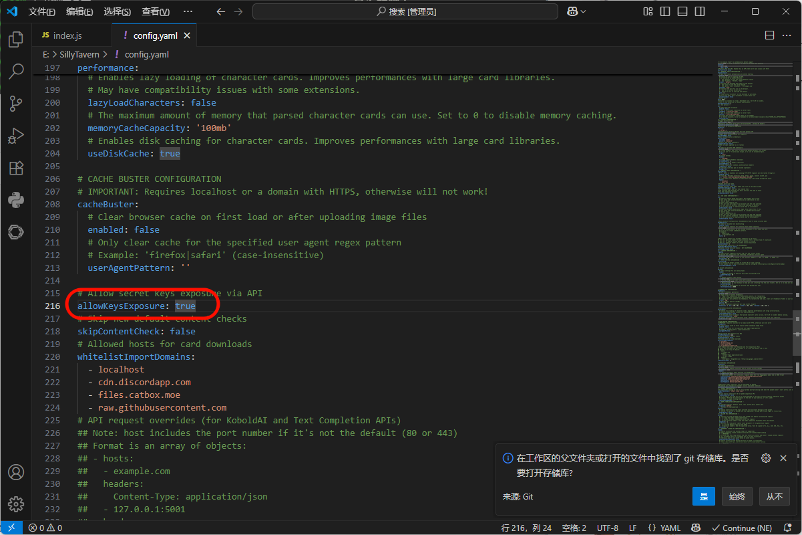
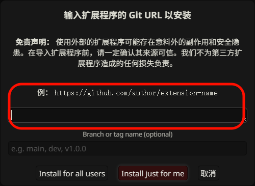

# API Balance Checker

SillyTavern 扩展插件 —— 一键查询 API 账户余额。

## ✨ 功能

- 🔘 在 SillyTavern 界面顶部注入**钱包图标按钮**，点击即可查询余额
- ⚡ 支持**生成完成后自动查询**余额（可选开关）
- 🔔 自动查询时可选择是否**弹出通知**
- 💾 所有配置**自动持久化**到 localStorage

## 📡 支持的 API 端点

| 端点类型 | 说明 | 查询方式 |
|---|---|---|
| `dashboard/billing/usage` | OpenAI 兼容格式（默认） | 直连 |
| `api/usage/token` | 通用余额查询端点 | 代理（不支持跨域） |
| `siliconflow` | 硅基流动专用 | 直连 |

### 查询策略

- **硅基流动**：直接调用 `https://api.siliconflow.cn/v1/user/info`，无需代理
- **dashboard/billing/usage**：支持跨域，插件直接请求你的 API 地址查询余额
- **api/usage/token**：不支持跨域（CORS），插件会通过代理服务 `https://apiproxy.9e.nz/proxy-request` 进行查询

## ⚠️ 前置要求

使用本插件前，需要先修改 SillyTavern 的配置文件以允许插件访问 API 密钥：

1. 打开 `SillyTavern/config.yaml`
2. 找到 `allowKeysExposure` 配置项，将其改为 `true`：

```diff
-allowKeysExposure: false
+allowKeysExposure: true
```

如图所示，找到该配置项并修改为 `true`：



3. 重启 SillyTavern 使配置生效

> [!IMPORTANT]
> 如果不开启此选项，插件将无法读取你配置的 API 密钥，余额查询功能将无法正常使用。

## 📦 安装

1. 打开 SillyTavern，进入扩展面板，找到「输入扩展程序的 Git URL 以安装」
2. 在输入框中填入：

```
https://github.com/15515151/myjjs
```

如图所示：



3. 点击 **Install just for me** 或 **Install for all users** 即可自动安装

## ⚙️ 配置

在扩展设置面板中展开 **API余额查询设置**：

- **自动查询**：勾选后，每次 AI 生成回复完成后自动查询余额
- **显示通知**：控制自动查询时是否弹出 toastr 通知
- **API端点类型**：根据你使用的 API 服务商选择对应端点

> **注意**：插件会自动读取你在 SillyTavern OpenAI 设置中配置的 API Key 和自定义 URL，无需额外配置密钥。

## 📁 文件结构

```
├── manifest.json   # 插件清单
├── index.js        # 主逻辑（源码）
├── style.css       # 样式
└── README.md       # 说明文档
```

## 📄 许可

MIT